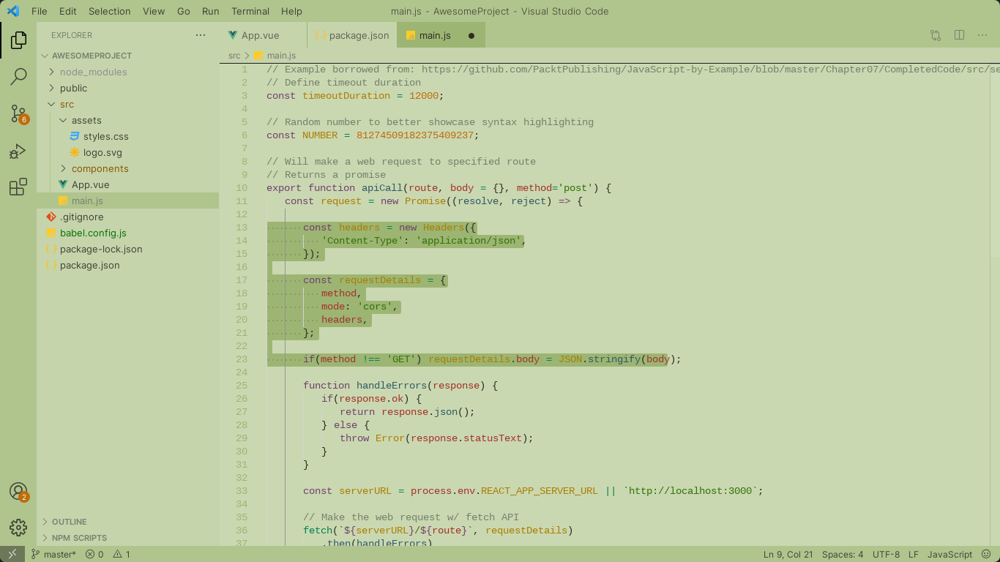

# Caret Theme

A theme for Visual Studio Code.
Inspired by the caret.nvim theme for NeoVim (https://github.com/projekt0n/caret.nvim)



## How release a new version

### Light

1. npm run package:light
2. npm run publish:light

### Dark

1. npm run package:dark
2. npm run publish:dark

## Dynamic theme

1. Install "Caret Light Theme"
2. Install "Caret Dark Theme"
3. Set these settings in VSCode:

```json
{
  "workbench.preferredLightColorTheme": "Caret Light Theme",
  "workbench.preferredDarkColorTheme": "Caret Dark Theme"
}
```
